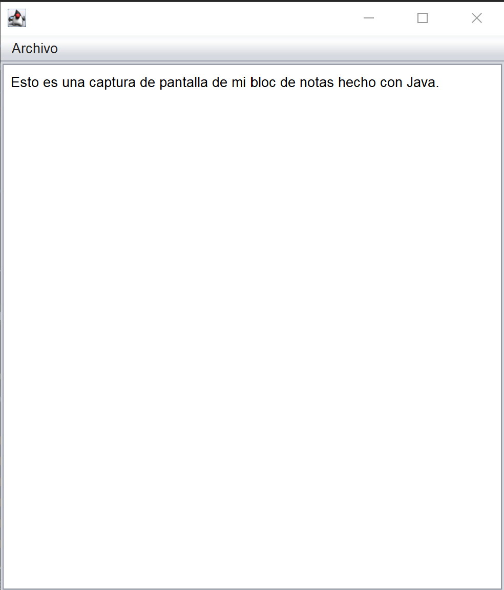

# 📝 Bloc de Notas en Java (Swing)

Aplicación de escritorio desarrollada en **Java** con **Swing**, que permite crear, abrir, editar y guardar archivos de texto plano.  
El proyecto se ha desarrollado como práctica del ciclo **DAM (Desarrollo de Aplicaciones Multiplataforma)** utilizando **NetBeans**.

---

## 📸 Captura de pantalla




---

## 🚀 Funcionalidades

- **Nuevo archivo**  
  Limpia completamente el área de texto y reinicia el editor.

- **Abrir archivo**  
  Permite seleccionar un archivo mediante `JFileChooser` y muestra su contenido.

- **Guardar**  
  - Si el archivo es nuevo → pide nombre y ruta.  
  - Si ya existe → guarda directamente sobre él.

- **Guardar como**  
  Solicita siempre nueva ubicación y nombre.  
  Pregunta antes de sobrescribir si el archivo ya existe.

---

## 🛠 Tecnologías utilizadas

- **Java 17**
- **Swing** (Interfaz gráfica)
- **NetBeans GUI Builder**
- Clases estándar de Java:
  - `File`
  - `BufferedReader`, `BufferedWriter`
  - `FileReader`, `FileWriter`
  - `JFileChooser`, `JOptionPane`

---

## 📁 Estructura del proyecto
bloc-notas-java/
┣ src/
┃ └ ventanaPrincipal/
┃ └ ventanaPrincipal.java
┣ nbproject/
┣ README.md
┣ .gitignore
┗ LICENSE

---

## 📚 Objetivo educativo

Este proyecto permite practicar conceptos fundamentales del módulo de **Entornos de Desarrollo**:

- Construcción de interfaces gráficas con Swing  
- Lectura y escritura de archivos en Java  
- Gestión de eventos en un menú  
- Documentación clara dentro del código  
- Uso de Git y GitHub de forma profesional  

---

## ▶ Cómo ejecutar el proyecto

1. Clonar el repositorio:
   ```bash
   git clone https://github.com/Jaimefontang/bloc-notas-java.git
2. Abrirlo en NetBeans.

3. Ejecutar la clase:
   ventanaPrincipal
   
---

✨ Mejoras futuras

Añadir título dinámico con el nombre del archivo

Atajos de teclado (Ctrl + S, Ctrl + N, Ctrl + O)

Cambio de fuente y tamaño en el editor

Implementar modo oscuro

Soporte para múltiples documentos con pestañas

---

📝 Licencia

Este proyecto está distribuido bajo la licencia MIT, lo que permite su uso, copia, modificación y distribución manteniendo los derechos de autor.

---
👤 Autor
Jaime Fontán
Estudiante de 2º DAM

   

